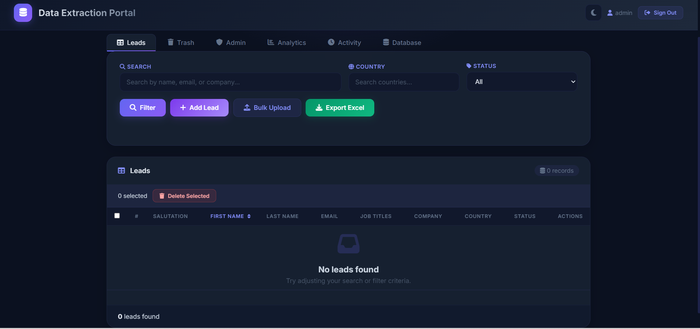
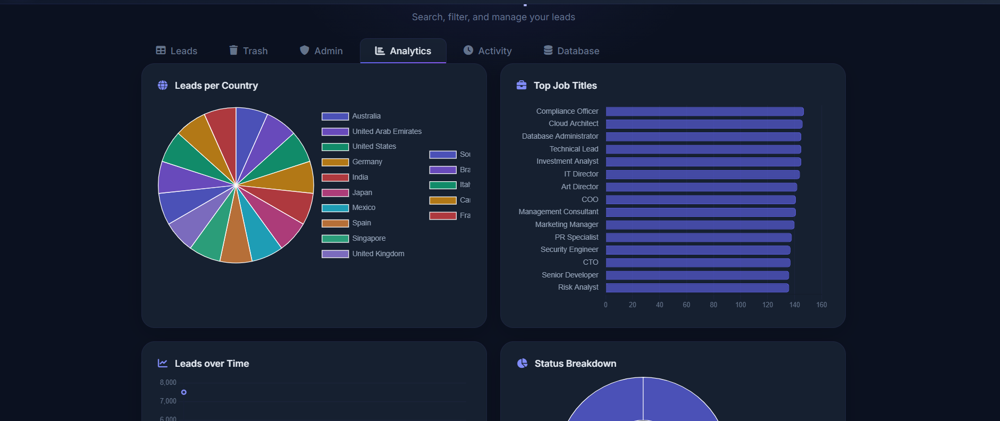

# Data Extraction Portal

A Flask + DuckDB web application for managing, importing, and analyzing lead data. Features role-based access control, multi-database support, audit logging, and interactive analytics.

## Quick Start

```bash
pip install -r requirements.txt
python app.py
```

Open `http://127.0.0.1:5001` and sign in with **admin / admin**.

## Tech Stack

| Component | Technology |
|---|---|
| Backend | Python 3, Flask |
| Database | DuckDB (embedded, file-per-database) |
| Auth | Werkzeug password hashing (pbkdf2) |
| UI | Server-rendered Jinja2 templates, Chart.js |
| Icons | Font Awesome 6 |
| Excel | openpyxl |

## Project Structure

```
flask_app/
├── app.py                  # Main Flask application (routes, auth, DB logic)
├── run_app.py              # Alternate launcher (port 5008)
├── start_app.bat           # Windows launcher (port 5000, opens browser)
├── seed_leads.py           # Generate 7500+ sample leads
├── requirements.txt        # Python dependencies
├── .gitignore
├── portal_master.db        # Default database (auto-created)
├── templates/
│   ├── login.html          # Sign-in page
│   ├── home.html           # Main dashboard (all tabs)
│   └── change_password.html# Forced password change screen
├── Helper File/
│   ├── New Features.txt
│   └── *.png               # Screenshots
└── venv/                   # Python virtual environment
```

## Features

### Authentication & Security

- **Password hashing**: Uses werkzeug `pbkdf2:sha256` (auto-migrates legacy SHA-256 hashes on login).
- **Forced password change**: Admin must change password on first login after migration.
- **Secret key**: Configured via `FLASK_SECRET_KEY` env var; falls back to `secrets.token_hex(32)`.
- **Session hardening**: `SESSION_COOKIE_HTTPONLY=True`, `SESSION_COOKIE_SAMESITE="Lax"`.

### Role-Based Access Control

| Role | Permissions |
|---|---|
| **admin** | Full access — create/edit/delete leads, manage users, switch/rename/delete databases, view audit log, bulk upload |
| **viewer** | Read-only — view leads, filter, export, analytics dashboard |

The `@role_required("admin")` decorator protects all mutating routes (leads, users, databases, bulk upload). Viewers receive a 403 JSON response for API routes and a flash redirect for form routes.

### Lead Management

- **Columns**: Salutation, First Name, Last Name, Email, Job Titles, Company Name, Country, Status
- **Lifecycle**: Status values — New, Contacted, Qualified, Lost, Deleted
- **Timestamps**: `created_at` (auto on insert), `updated_at` (set on update)
- **Soft delete**: Deleting sets Status to 'Deleted' instead of hard-removing; normal queries exclude deleted records.
- **Trash tab**: Admin-only view of soft-deleted leads with Restore button.
- **Search**: Real-time text search across name, email, and company fields.
- **Multi-country filter**: Select multiple countries; tags display active filters.
- **Status filter**: Dropdown to filter by lead status.
- **Inline editing**: Click the edit icon on any row to open an inline popup.
- **Bulk actions**: Select rows via checkboxes, then bulk-delete selected.

### Data Import

- **CSV upload** (file or JSON body): Uses `csv.DictReader` — supports quoted fields, embedded commas.
- **Excel upload**: `.xlsx` / `.xls` via openpyxl.
- **Column mapping**: Auto-detects columns by name (supports `first_name`, `First Name`, `company`, `Company Name`, `job_title`, etc.).
- **Duplicate detection**: Case-insensitive email dedup — duplicate emails are skipped and reported.
- **Error reporting**: Returns first 10 errors per batch with row numbers.

### Export

- **Excel export**: Exports currently filtered data (respects country + status filters).
- Triggered via the "Export Excel" button in the filter bar (JavaScript builds dynamic URL).

### Database Management

- **Session-scoped**: Each user's active database is stored in `session["db_path"]`. Switch/create/rename/delete operations update the session per user.
- **Create**: `POST /api/databases/create` — creates new `.db` with full schema.
- **Switch**: `POST /api/databases/switch` — changes active database for the session.
- **Rename**: `POST /api/databases/rename` — renames the file on disk, updates session if active.
- **Delete**: `POST /api/databases/delete` — removes the `.db` file (cannot delete active or master).
- **List**: `GET /api/databases` — returns all `.db` files sorted by modification time.

### Analytics

- **Country breakdown**: Bar chart of leads per country.
- **Job titles**: Top 15 job titles.
- **Leads over time**: Line chart (daily lead creation).
- **Status breakdown**: Doughnut chart showing distribution across New, Contacted, Qualified, Lost.
- **Email fill rate**: Percentage of leads with email addresses.

All charts use Chart.js (loaded from CDN).

### Audit Log

- **Tracked actions**: login, create/update/delete/restore/bulk_delete Lead, create/delete User, create/switch/rename/delete Database, change_password, bulk_upload.
- **Stored**: `AuditLog` table — user_id, username, action, entity_type, entity_id, details (JSON), created_at.
- **Admin-only**: "Activity" tab shows the last 200 entries (server-rendered + `/api/audit-log` JSON endpoint).

## API Endpoints

### Leads

| Method | Endpoint | Auth | Description |
|---|---|---|---|
| GET | `/api/leads` | any | List leads (supports pagination, search, sort, country, status, trash filters) |
| POST | `/api/leads` | admin | Create lead (JSON body) |
| PUT | `/api/leads/<rowid>` | admin | Update lead fields |
| DELETE | `/api/leads/<rowid>` | admin | Soft-delete lead (Status → Deleted) |
| POST | `/api/leads/<rowid>/restore` | admin | Restore from trash (Status → New) |
| POST | `/api/leads/bulk-delete` | admin | Soft-delete multiple leads by IDs array |
| GET | `/api/leads/countries` | any | Country list with counts |
| GET | `/api/leads/stats` | any | Aggregate stats (total, email fill, countries, salutations) |

### Databases

| Method | Endpoint | Auth | Description |
|---|---|---|---|
| GET | `/api/databases` | any | List databases, current selection |
| POST | `/api/databases/create` | admin | Create new database |
| POST | `/api/databases/switch` | admin | Switch active database |
| POST | `/api/databases/rename` | admin | Rename database file |
| POST | `/api/databases/delete` | admin | Delete database file |

### Other

| Method | Endpoint | Auth | Description |
|---|---|---|---|
| GET | `/api/audit-log` | admin | Last N audit log entries |
| POST | `/bulk-upload` | admin | Import CSV/Excel file or JSON CSV |
| POST | `/add-lead` | admin | Create lead via form POST |
| POST | `/users/create` | admin | Create user |
| POST | `/users/delete/<id>` | admin | Delete user |

## Running

```bash
# Development (port 5001)
python app.py

# Alternate (port 5008)
python run_app.py

# Windows double-click
start_app.bat
```

## Seeding Data

```bash
python seed_leads.py
```

Generates ~7500 leads across 15 countries with realistic names, job titles, and companies.

## Database Schema

### Leads
| Column | Type | Notes |
|---|---|---|
| Salutation | VARCHAR | Mr., Ms., Dr., etc. |
| First Name | VARCHAR | Required |
| Last Name | VARCHAR | Required |
| Email | VARCHAR | |
| Job Titles | VARCHAR | |
| Company Name | VARCHAR | |
| Country | VARCHAR | |
| Status | VARCHAR | Default: `New` |
| created_at | TIMESTAMP | Auto on insert |
| updated_at | TIMESTAMP | Set on update |

### Users
| Column | Type | Notes |
|---|---|---|
| id | INTEGER | Primary key, auto-increment |
| username | VARCHAR | Unique |
| password_hash | VARCHAR | Werkzeug pbkdf2 hash |
| role | VARCHAR | `admin` or `viewer` |
| must_change_pw | INTEGER | Flag for forced password change |
| created_at | TIMESTAMP | |

### AuditLog
| Column | Type | Notes |
|---|---|---|
| id | INTEGER | Primary key |
| user_id | INTEGER | FK to Users |
| username | VARCHAR | Snapshot at log time |
| action | VARCHAR | e.g. `create`, `delete`, `login` |
| entity_type | VARCHAR | `Lead`, `User`, `Database` |
| entity_id | VARCHAR | |
| details | VARCHAR | JSON payload |
| created_at | TIMESTAMP | |

## Screenshots & Demos

### Login Page


### Home Page - Main Dashboard


### Activity Tracking


### Analytics Dashboard


### Database Management


### Admin User Management & Access Control


### Change Password at First Login


### Recycle Bin - Soft Delete Restoration

